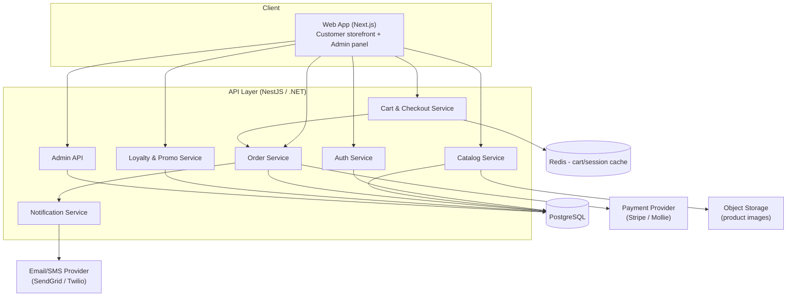

# FoodIndustry — Data Model & Architecture (Draft v1)

> Derived from [MVP.md](./MVP.md). This is a first pass — designed to be adjusted once sourcing model & monetization are decided (see open items, marked below).

## 1. Entity-Relationship Diagram

```mermaid
erDiagram
    USER ||--o{ ADDRESS : has
    USER ||--o{ ORDER : places
    USER ||--o| LOYALTY_ACCOUNT : owns
    USER ||--o{ REVIEW : writes

    CATEGORY ||--o{ PRODUCT : contains
    PRODUCT ||--o{ STOCK_ITEM : "tracked as"
    PRODUCT ||--o{ ORDER_ITEM : "ordered as"
    PRODUCT ||--o{ REVIEW : receives

    STORE_LOCATION ||--o{ STOCK_ITEM : holds
    STORE_LOCATION ||--o{ PICKUP_SLOT : offers
    DELIVERY_ZONE ||--o{ DELIVERY_SLOT : offers

    ORDER ||--|{ ORDER_ITEM : contains
    ORDER ||--o| PAYMENT : "paid via"
    ORDER ||--o| DELIVERY_SLOT : "fulfilled via"
    ORDER ||--o| PICKUP_SLOT : "fulfilled via"
    ORDER ||--o| ADDRESS : "delivered to"
    ORDER }o--o| PROMO_CODE : "redeems"
    ORDER ||--o| LOYALTY_TRANSACTION : generates

    LOYALTY_ACCOUNT ||--o{ LOYALTY_TRANSACTION : logs

    USER {
        uuid id PK
        string email UK
        string password_hash
        string first_name
        string last_name
        string phone
        datetime created_at
    }

    ADDRESS {
        uuid id PK
        uuid user_id FK
        string label
        string street
        string house_number
        string postal_code
        string city
        string country
        bool is_default
    }

    CATEGORY {
        uuid id PK
        uuid parent_category_id FK "nullable, self-ref"
        string name
        int sort_order
    }

    PRODUCT {
        uuid id PK
        uuid category_id FK
        string sku UK
        string name
        string description
        string unit "e.g. kg, pcs, L"
        decimal price
        string currency "EUR"
        decimal vat_rate "e.g. 6% Belgian reduced food rate"
        json allergens
        string image_url
        bool is_active
    }

    STORE_LOCATION {
        uuid id PK
        string name
        string address
        string city
        string type "warehouse | partner_store"
    }

    STOCK_ITEM {
        uuid id PK
        uuid product_id FK
        uuid store_location_id FK
        int quantity_available
        datetime last_updated
    }

    DELIVERY_ZONE {
        uuid id PK
        string name "e.g. Brussels, Antwerp"
        string postal_codes "csv or range"
        decimal delivery_fee
    }

    DELIVERY_SLOT {
        uuid id PK
        uuid delivery_zone_id FK
        datetime window_start
        datetime window_end
        int capacity
        int booked_count
    }

    PICKUP_SLOT {
        uuid id PK
        uuid store_location_id FK
        datetime window_start
        datetime window_end
        int capacity
        int booked_count
    }

    ORDER {
        uuid id PK
        uuid user_id FK
        string fulfillment_type "delivery | pickup"
        uuid delivery_slot_id FK "nullable"
        uuid pickup_slot_id FK "nullable"
        uuid delivery_address_id FK "nullable"
        uuid promo_code_id FK "nullable"
        decimal subtotal
        decimal discount_amount
        decimal delivery_fee
        decimal total
        string status "placed|preparing|ready|out_for_delivery|completed|cancelled"
        datetime created_at
        datetime updated_at
    }

    ORDER_ITEM {
        uuid id PK
        uuid order_id FK
        uuid product_id FK
        int quantity
        decimal unit_price "price at time of order"
        decimal line_total
    }

    PAYMENT {
        uuid id PK
        uuid order_id FK
        string method "card|bancontact|ideal|cash_on_delivery|card_on_delivery"
        string provider "stripe|mollie|none"
        string provider_reference
        decimal amount
        string status "pending|paid|failed|refunded"
        datetime paid_at
    }

    PROMO_CODE {
        uuid id PK
        string code UK
        string discount_type "percentage|fixed"
        decimal discount_value
        decimal min_order_value
        datetime valid_from
        datetime valid_until
        int usage_limit
        int usage_count
    }

    LOYALTY_ACCOUNT {
        uuid id PK
        uuid user_id FK
        int points_balance
    }

    LOYALTY_TRANSACTION {
        uuid id PK
        uuid loyalty_account_id FK
        uuid order_id FK "nullable, null = manual adjustment"
        int points_change "positive = earned, negative = redeemed"
        string reason
        datetime created_at
    }

    REVIEW {
        uuid id PK
        uuid user_id FK
        uuid product_id FK
        int rating "1-5"
        string comment
        datetime created_at
    }
```

### Notes on open decisions affecting this model
- **`STORE_LOCATION.type`** (`warehouse` vs `partner_store`) is a placeholder so the schema works either way once the sourcing model **[OPEN in MVP.md §9]** is decided. If you go multi-partner, we'll likely split this into its own `VENDOR` entity with commission/settlement fields.
- **`DELIVERY_ZONE.delivery_fee`** and a potential `subscription` flag on `USER` are placeholders for the monetization decision **[OPEN in MVP.md §9]**. If you choose subscriptions, we'd add a `SUBSCRIPTION_PLAN` / `SUBSCRIPTION` entity.

## 2. High-Level Architecture

### Component notes
- **Cart & Checkout Service** uses Redis (or in-memory session) for fast, ephemeral cart state before an order is finalized — avoids writing to Postgres on every "add to cart" click.
- **Order Service** is the source of truth once checkout completes: creates `ORDER` + `ORDER_ITEM` rows, calls the **Payment Provider** for online payments, or marks `PAYMENT.method = cash_on_delivery/card_on_delivery` with `status = pending` until fulfillment.
- **Admin API** reuses the same services (Catalog, Orders) but with role-gated endpoints for staff to manage products, stock, promo codes, and update order status.
- **Notification Service** listens for order status changes and triggers email/SMS.

## 3. Suggested Build Order (maps to MVP.md §4 priorities)
1. Auth + User + Address
2. Catalog (Category, Product, Stock — manual stock entry)
3. Cart → Checkout → Order → Order Item
4. Payment integration (online + cash/card-on-receipt)
5. Delivery/Pickup slots (Delivery Zone, Delivery Slot, Pickup Slot)
6. Promo codes + Loyalty accounts/transactions
7. Admin panel screens for all of the above
8. Notifications (email/SMS)

---
### Open items to revisit once decided
- [ ] Sourcing model → confirm `STORE_LOCATION`/`STOCK_ITEM` shape (single warehouse vs. multi-partner)
- [ ] Monetization → confirm whether `DELIVERY_ZONE.delivery_fee` is enough, or a `SUBSCRIPTION` entity is needed
